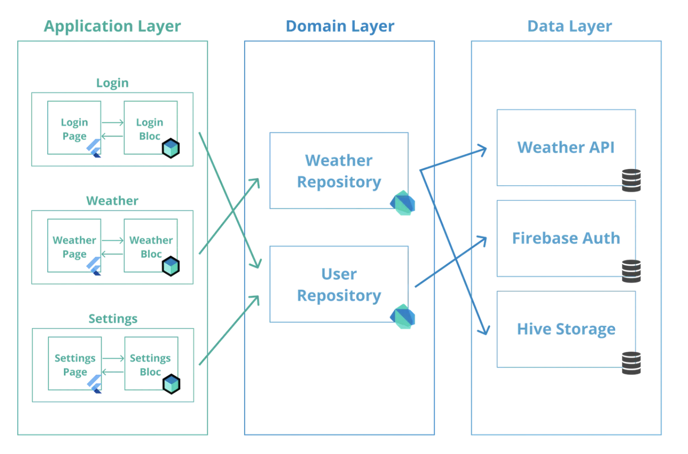

# Flutter Clean Architecture Guide

> 이 문서는 본 프로젝트의 아키텍처를 다른 프로젝트에 적용할 때 참고하는 가이드입니다.

> 본 문서는 아래 공식 문서를 기반으로 작성되었습니다.
> - https://bloclibrary.dev/architecture/
> - https://docs.flutter.dev/app-architecture/guide

---

## 목차

1. [아키텍처 개요](#1-아키텍처-개요)
2. [레이어 구조와 의존성 규칙](#2-레이어-구조와-의존성-규칙)
3. [Domain Layer](#3-domain-layer)
4. [Data Layer](#4-data-layer)
5. [Presentation Layer](#5-presentation-layer)
6. [Core Layer](#6-core-layer)
7. [의존성 주입 (DI)](#7-의존성-주입-di)
8. [상태 관리 패턴](#8-상태-관리-패턴)
9. [데이터 흐름](#9-데이터-흐름)
10. [새 피쳐 추가 가이드](#10-새-피쳐-추가-가이드)
11. [네이밍 컨벤션](#11-네이밍-컨벤션)
12. [테스트 전략](#12-테스트-전략)
13. [기술 스택](#13-기술-스택)

---

## 1. 아키텍처 개요

3계층 Clean Architecture를 채택합니다. 핵심 원칙은 **의존성 역전(DIP)** 입니다. 안쪽 레이어(Domain)는 바깥 레이어를 모르고, 바깥 레이어만 안쪽을 참조합니다.




```
┌─────────────────────────────────────────────┐
│            Presentation Layer               │
│    (UI, State Management, Widgets, Hooks)   │
├─────────────────────────────────────────────┤
│              Domain Layer                   │
│  (Entities, Repository Interfaces, UseCases)│
├─────────────────────────────────────────────┤
│               Data Layer                    │
│  (Repository Impl, DataSources, DTOs)       │
└─────────────────────────────────────────────┘
```

```
┌─ Presentation ──────────────────────────────────────────────┐
│                                                             │
│  Page (HookWidget)                                          │
│    ├── BlocProvider → Bloc (Event → State)                  │
│    └── BlocListener (side effect: SnackBar 등)              │
│                              │                              │
│                              ▼                              │
│                        State (Freezed)                      │
│                              │                              │
│                              ▼                              │
│  StockView (StatelessWidget + BlocSelector)                  │
│    ├── StockAppBarView (BlocSelector × 2)                   │
│    └── ListView                                             │
│        ├── StockPriceView (BlocSelector)                    │
│        ├── StockSummaryView                                 │
│        ├── StockInputView                                   │
│        ├── StockExpansionView                               │
│        └── StockEtcView                                     │
│                                                             │
└─────────────────────────────────────────────────────────────┘
                             │ 참조 (인터페이스만)
┌─ Domain ───────────────────┼────────────────────────────────┐
│                            ▼                                │
│  UseCase ──────────▶ Repository (abstract interface)        │
│                            ▲                                │
│  Entity (Freezed)          │                                │
│                            │                                │
└────────────────────────────┼────────────────────────────────┘
                             │ implements (구현)
┌─ Data ─────────────────────┼────────────────────────────────┐
│                            │                                │
│  Repository Impl ──▶ DataSource ──▶ Model/DTO (Freezed+JSON)│
│                                                             │
└─────────────────────────────────────────────────────────────┘

┌─ Core ──────────────────────────────────────────────────────┐
│  DI Container (GetIt)          Extensions                   │
│  ···registers DataSource, Repository Impl, UseCase          │
└─────────────────────────────────────────────────────────────┘
```

---

## 2. 레이어 구조와 의존성 규칙

### 디렉토리 구조

```
lib/
├── core/                          # 공통 인프라
│   ├── di/                        #   DI 컨테이너 설정
│   └── extensions/                #   확장 함수
│
├── domain/                        # 순수 비즈니스 로직
│   ├── {도메인명}/
│   │   ├── entities/              #   불변 엔티티
│   │   ├── repos/                 #   Repository 인터페이스
│   │   └── {도메인명}.dart         #   배럴 파일
│   └── usecases/                  #   교차 도메인 비즈니스 로직
│
├── data/                          # 외부 데이터 접근
│   ├── {소스명}/                   #   데이터소스 그룹 (API별)
│   │   ├── datasources/           #     DataSource 구현
│   │   ├── models/                #     DTO 모델
│   │   └── {소스명}.dart           #     배럴 파일
│   └── repositories/              #   Repository 구현체
│
└── presentation/                  # UI
    ├── hooks/                     #   커스텀 Flutter Hooks
    └── pages/{페이지명}/
        ├── {페이지명}_page.dart    #   진입점 (DI 주입, Hook 설정)
        ├── {페이지명}_bloc.dart    #   상태 관리 (Bloc)
        ├── {페이지명}_event.dart   #   이벤트 정의
        ├── {페이지명}_state.dart   #   불변 상태 클래스
        ├── {페이지명}_view.dart    #   메인 UI
        └── widgets/               #   세부 위젯
```

### 의존성 규칙

```
    ┌──────────────┐
    │ Presentation │ ── UI, 상태관리, 위젯
    └──────┬───────┘
           │ depends on (인터페이스만 참조)
           ▼
    ┌──────────────┐
    │    Domain    │ ── 순수 비즈니스 로직 (프레임워크 무관)
    └──────▲───────┘
           │ implements (구현)
    ┌──────┴───────┐
    │     Data     │ ── API 호출, DB 저장, DTO 변환
    └──────────────┘

    ※ Presentation ↔ Data 직접 참조 금지
    ※ Domain은 어디에도 의존하지 않음 (가장 안쪽 원)
```

| 규칙 | 설명 |
|------|------|
| Domain은 어디에도 의존하지 않는다 | Flutter/Dart SDK 외 import 금지. 가장 안정적인 레이어. |
| Presentation은 Domain만 참조한다 | Repository 인터페이스와 Entity만 사용. Data 레이어 직접 참조 금지. |
| Data는 Domain을 구현한다 | Repository 인터페이스의 구현체를 제공. Presentation을 몰라야 함. |
| Presentation ↔ Data 직접 참조 금지 | GetIt(DI)을 통해 런타임에 연결. |

---

## 3. Domain Layer

**역할**: 비즈니스 규칙 정의. 프레임워크에 의존하지 않는 순수 Dart 코드.

### 3-1. Entity

불변 도메인 객체. `@freezed`로 `copyWith`, `==`, `toString` 자동 생성.

```dart
// domain/stock/entities/stock.dart
@freezed
abstract class Stock with _$Stock {
  const Stock._();  // 커스텀 getter 사용 시 필요

  const factory Stock({
    @Default('') String code,
    @Default('') String name,
    @Default(0.0) double changeRate,
    @Default([]) List<int> priceHistory,
  }) = _Stock;

  // 파생 속성은 getter로 정의
  int get currentPrice => priceHistory.isEmpty ? 0 : priceHistory.last;
}
```

**규칙:**
- 모든 필드에 `@Default` 값을 지정하여 `const factory` 사용
- JSON 직렬화 코드 **없음** (Domain은 전송 형식을 모름)
- 파생 속성은 `getter`로 정의 (`const Stock._()` 필요)

### 3-2. Repository Interface

데이터 접근 계약. `abstract interface class`로 선언.

```dart
// domain/stock/repos/stock_repository.dart
abstract interface class StockRepository {
  Future<Stock> getStock(String code);
  Stream<Stock> stockTickStream(String code);
  Future<void> connect();
  void disconnect();
}
```

**규칙:**
- 반환 타입은 항상 **Domain Entity** (DTO 반환 금지)
- `abstract interface class` 키워드 사용 (Dart 3 인터페이스)
- 구현은 Data Layer에 위임

### 3-3. UseCase

2개 이상의 도메인에 걸친 비즈니스 로직을 캡슐화.

```dart
// domain/usecases/toggle_watchlist_use_case.dart
class ToggleWatchlistUseCase {
  const ToggleWatchlistUseCase(this._repository);

  final WatchlistRepository _repository;

  Future<void> call({
    required WatchlistItem item,
    required bool isInWatchlist,
  }) async {
    if (isInWatchlist) {
      await _repository.removeItem(item.stockCode);
    } else {
      await _repository.addItem(item);
    }
  }
}
```

**규칙:**
- `call()` 메서드로 실행 (함수처럼 호출 가능: `useCase(...)`)
- 생성자에서 Repository 인터페이스를 주입받음
- 단일 도메인 내 단순 CRUD는 UseCase 없이 Repository 직접 사용 가능

### 3-4. 배럴 파일

도메인별 공개 API를 하나의 import로 제공.

```dart
// domain/watchlist/watchlist.dart
export 'entities/alert_type.dart';
export 'entities/watchlist_item.dart';
export 'repos/watchlist_repository.dart';
```

---

## 4. Data Layer

**역할**: 외부 데이터 소스(API, DB) 접근 및 Domain Entity 변환.

### 4-1. Model (DTO)

외부 데이터 형식과 매핑되는 전송 객체.

```dart
// data/ezar/models/stock_model.dart
@freezed
abstract class StockModel with _$StockModel {
  const factory StockModel({
    @Default('') String code,
    @Default('') String name,
    @Default(0.0) double changeRate,
    @Default([]) List<int> priceHistory,
  }) = _StockModel;

  factory StockModel.fromJson(Map<String, dynamic> json) =>
      _$StockModelFromJson(json);
}
```

**Entity vs Model 차이:**

| 구분 | Entity (Domain) | Model (Data) |
|------|----------------|--------------|
| 위치 | `domain/{도메인}/entities/` | `data/{소스}/models/` |
| JSON 직렬화 | 없음 | `fromJson` / `toJson` |
| Hive 어노테이션 | 없음 | `@HiveType` (로컬 DB용) |
| 비즈니스 로직 | getter로 파생 속성 | 없음 (순수 데이터) |

### 4-2. DataSource

실제 데이터 소스에 접근하는 클래스.

```dart
// data/ezar/datasources/stock_data_source_ezar.dart
class StockDataSourceEzar {
  Future<StockModel> getStock(String code) {
    // HTTP API 호출 → StockModel 반환
  }
}
```

```dart
// data/local/datasources/watchlist_data_source_local.dart
class WatchlistDataSourceLocal {
  final Box<WatchlistItemModel> _box;

  static Future<WatchlistDataSourceLocal> init() async {
    final box = await Hive.openBox<WatchlistItemModel>(boxName);
    return WatchlistDataSourceLocal(box);
  }

  List<WatchlistItemModel> getAll() => _box.values.toList();
  Future<void> add(WatchlistItemModel item) => _box.put(item.stockCode, item);
}
```

**규칙:**
- DataSource는 **Model(DTO)** 을 반환 (Entity 반환 금지)
- 데이터소스 종류별 디렉토리 분리 (`ezar/`, `local/`, `firebase/` 등)
- 비동기 초기화가 필요하면 `static Future<T> init()` 팩토리 패턴 사용

### 4-3. Repository Implementation

Domain의 Repository 인터페이스를 구현. **Model → Entity 변환 책임**.

```dart
// data/repositories/stock_repository_impl.dart
class StockRepositoryImpl implements StockRepository {
  final StockDataSourceEzar _stockDataSource;
  final StockTickDataSourceEzar _tickDataSource;

  StockRepositoryImpl(this._stockDataSource, this._tickDataSource);

  @override
  Future<Stock> getStock(String code) async {
    final model = await _stockDataSource.getStock(code);
    return Stock(                   // ← Model → Entity 변환
      code: model.code,
      name: model.name,
      changeRate: model.changeRate,
      priceHistory: model.priceHistory,
    );
  }

  @override
  Stream<Stock> stockTickStream(String code) {
    return _tickDataSource.messageStream
        .where((tick) => tick.stockCode == code)
        .map((tick) => Stock(       // ← Model → Entity 변환
          code: tick.stockCode,
          changeRate: tick.changeRate,
          priceHistory: [tick.currentPrice],
        ));
  }
}
```

**규칙:**
- `implements`로 Domain 인터페이스 구현 (extends 아님)
- DataSource를 생성자 주입받음
- 여기서 DTO ↔ Entity 변환 수행
- Stream 변환도 Repository에서 처리

---

## 5. Presentation Layer

**역할**: UI 렌더링, 사용자 인터랙션 처리, 상태 관리.

### 5-1. Page (진입점)

`HookWidget`으로 DI 주입과 Bloc 생성을 담당.

```dart
// presentation/pages/stock/stock_page.dart
class StockPage extends HookWidget {
  const StockPage({super.key, required this.stockCode});
  final String stockCode;

  @override
  Widget build(BuildContext context) {
    // 1. Hook으로 컨트롤러/리소스 초기화
    final tabScrollController = useTabScrollController(tabViewCount: 5);

    // 2. BlocProvider로 Bloc 생성 + DI 주입
    return BlocProvider(
      create: (_) => StockBloc(
        stockRepository: getIt<StockRepository>(),
        watchlistRepository: getIt<WatchlistRepository>(),
        toggleWatchlistUseCase: getIt<ToggleWatchlistUseCase>(),
      )..add(StockInitialized(stockCode: stockCode)),

      // 3. BlocListener로 side effect 처리
      child: BlocListener<StockBloc, StockState>(
        listenWhen: (prev, curr) =>
            prev.stock.currentPrice != curr.stock.currentPrice &&
            curr.needsTargetPriceAlert != null,
        listener: (context, state) {
          final alert = state.needsTargetPriceAlert!;
          final direction = alert.isUpper ? '상한 돌파' : '하한 돌파';
          ScaffoldMessenger.of(context)
            ..hideCurrentSnackBar()
            ..showSnackBar(SnackBar(
              content: Text('${alert.stockCode} 목표가 ${alert.targetPrice}원 $direction'),
            ));
        },
        child: StockView(tabScrollController: tabScrollController),
      ),
    );
  }
}
```

**Page의 책임:**
1. GetIt에서 의존성을 꺼내 Bloc에 주입
2. Hook으로 리소스(컨트롤러 등) 초기화
3. Side effect(SnackBar, Navigation 등) BlocListener로 처리 (`listenWhen`에서 조건 판단)
4. View 위젯에 렌더링 위임

### 5-2. Bloc (상태 관리)

`Bloc<Event, State>`를 상속하여 이벤트 기반으로 상태를 변경.

```dart
// presentation/pages/stock/stock_bloc.dart
class StockBloc extends Bloc<StockEvent, StockState> {
  StockBloc({
    required StockRepository stockRepository,
    required WatchlistRepository watchlistRepository,
    required ToggleWatchlistUseCase toggleWatchlistUseCase,
  }) : _stockRepository = stockRepository,
       _watchlistRepository = watchlistRepository,
       _toggleWatchlistUseCase = toggleWatchlistUseCase,
       super(const StockState()) {
    on<StockInitialized>(_onInitialized);
    on<StockFavoriteToggled>(_onFavoriteToggled);
    on<StockWatchlistAdded>(_onWatchlistAdded);
    on<StockTickReceived>(_onTickReceived);
  }

  Future<void> _onInitialized(
    StockInitialized event,
    Emitter<StockState> emit,
  ) async {
    await _fetchStock(event.stockCode, emit);
    if (state.hasError) return;
    await _fetchWatchlist(emit);
    await _subscribeTick(event.stockCode);
  }

  void _onTickReceived(StockTickReceived event, Emitter<StockState> emit) {
    final stock = state.stock;
    emit(state.copyWith(
      stock: stock.copyWith(
        changeRate: event.tick.changeRate,
        priceHistory: [...stock.priceHistory, event.tick.currentPrice],
      ),
    ));
  }

  @override
  Future<void> close() {
    _tickSubscription?.cancel();
    _stockRepository.disconnect();
    return super.close();
  }
}
```

**Bloc의 책임:**
- 이벤트(Event)를 받아 불변 State를 `emit(state.copyWith(...))` 으로 갱신
- Repository / UseCase를 호출하여 데이터 fetch
- Stream 구독 및 생명주기 관리 (close)
- 에러 발생 시 `rethrow` / `Error.throwWithStackTrace`로 글로벌 로깅 지원
- UI 표시 판단(알림 등)은 State getter + BlocListener에 위임

### 5-3. State (불변 상태)

`@freezed`로 불변 상태 객체를 정의. 파생 속성은 `getter`로 표현.

```dart
// presentation/pages/stock/stock_state.dart
@freezed
abstract class StockState with _$StockState {
  const StockState._();

  const factory StockState({
    @Default(Stock()) Stock stock,
    @Default(true) bool isLoading,
    @Default([]) List<WatchlistItem> watchlist,
  }) = _StockState;

  // 파생 상태: 별도 필드 없이 기존 상태에서 계산
  bool get hasError => !isLoading && stock.code.isEmpty;
  bool get isInWatchlist =>
      watchlist.any((item) => item.stockCode == stock.code);

  // UI 판단용 getter: 목표가 돌파 시 알림 데이터 반환, 미충족 시 null
  ({String stockCode, int targetPrice, bool isUpper})?
      get needsTargetPriceAlert { /* ... */ }
}
```

**State 설계 원칙:**
- 모든 필드에 `@Default` 값 → `const StockState()` 로 초기화 가능
- UI가 직접 판단할 로직은 `getter`로 (hasError, isInWatchlist, needsTargetPriceAlert 등)
- 1회성 side effect 데이터는 필드로 저장하지 않고 getter로 파생
- State 자체에 비즈니스 로직 금지 (순수 데이터 + 파생 속성만)

### 5-4. View + Widgets (UI)

`StatelessWidget` + `BlocSelector`로 선택적 리빌드.

```dart
// presentation/pages/stock/stock_view.dart
class StockView extends StatelessWidget {
  const StockView({super.key, required this.tabScrollController});
  final TabScrollController tabScrollController;

  @override
  Widget build(BuildContext context) {
    return BlocSelector<StockBloc, StockState, ({bool hasError, bool isLoading})>(
      selector: (state) =>
          (hasError: state.hasError, isLoading: state.isLoading),
      builder: (context, state) {
        if (state.hasError) return /* 에러 UI */;
        if (state.isLoading) return /* 로딩 UI */;
        return Scaffold(
          appBar: StockAppBarView(tabController: ..., onTabTap: ...),
          body: ListView(
            children: [
              StockPriceView(key: ...),       // 가격 섹션
              StockSummaryView(key: ...),     // 요약 섹션
              StockInputView(key: ...),       // 입력 섹션
              StockExpansionView(key: ...),   // 확장 패널 섹션
              StockEtcView(key: ...),         // 기타 섹션
            ],
          ),
        );
      },
    );
  }
}
```

**UI 규칙:**
- `BlocSelector`로 필요한 상태만 구독 → 불필요한 rebuild 방지
- 섹션별 위젯 파일 분리 (`widgets/` 디렉토리) → `{페이지}_{섹션}_view.dart`
- View는 `StatelessWidget` (상태는 Bloc이 관리)
- 각 섹션 위젯은 독립적으로 `BlocSelector`를 사용하여 필요한 상태만 구독

### 5-5. Custom Hooks

재사용 가능한 상태 로직을 Hook으로 추출.

```dart
// 탭-스크롤 동기화 컨트롤러
TabScrollController useTabScrollController({required int tabViewCount});
```

> Side effect(SnackBar, Navigation 등)는 `BlocListener`로 처리하므로 `useListenableEffect`가 필요 없습니다.

---

## 6. Core Layer

**역할**: 레이어 전체에서 공유하는 인프라 코드.

```dart
// core/di/injection.dart  → DI 컨테이너 설정
// core/extensions/         → 유틸리티 확장 함수
```

**규칙:**
- Core는 어떤 레이어든 import 가능
- 비즈니스 로직 금지 (순수 유틸리티, 인프라만)
- 향후 `core/error/`, `core/network/`, `core/constants/` 등 추가 가능

---

## 7. 의존성 주입 (DI)

GetIt 서비스 로케이터로 런타임에 의존성을 연결합니다.

```dart
// core/di/injection.dart
final getIt = GetIt.instance;

Future<void> initDependencies() async {
  // 1. DataSource (Singleton) — 앱 생명주기 동안 유지
  getIt.registerSingleton(await WatchlistDataSourceLocal.init());
  getIt.registerSingleton(StockDataSourceEzar());
  getIt.registerSingleton(StockTickDataSourceEzar());

  // 2. Repository (Singleton, 인터페이스 타입으로 등록)
  getIt.registerSingleton<WatchlistRepository>(        // ← 인터페이스!
    WatchlistRepositoryImpl(getIt<WatchlistDataSourceLocal>()),
  );
  getIt.registerSingleton<StockRepository>(            // ← 인터페이스!
    StockRepositoryImpl(
      getIt<StockDataSourceEzar>(),
      getIt<StockTickDataSourceEzar>(),
    ),
  );

  // 3. UseCase (Factory) — 매번 새 인스턴스
  getIt.registerFactory(
    () => ToggleWatchlistUseCase(getIt<WatchlistRepository>()),
  );
  getIt.registerFactory(
    () => CheckTargetPriceUseCase(getIt<WatchlistRepository>()),
  );
}
```

```
┌─ GetIt Container ──────────────────────────────────────────┐
│                                                            │
│  Singleton (앱 생명주기 동안 유지)                            │
│  ┌────────────────────────────────────────────────────┐    │
│  │  DataSource ──────────────────────┐                │    │
│  │  ├── WatchlistDataSourceLocal     │                │    │
│  │  ├── StockDataSourceEzar          │ 주입            │    │
│  │  └── StockTickDataSourceEzar      ▼                │    │
│  │  Repository (인터페이스 타입 등록)                    │    │
│  │  ├── StockRepository      ← StockRepositoryImpl    │    │
│  │  └── WatchlistRepository  ← WatchlistRepositoryImpl│    │
│  └────────────────────────────────────────────────────┘    │
│                                          │ 주입             │
│  Factory (매번 새 인스턴스)                 ▼                 │
│  ┌────────────────────────────────────────────────────┐    │
│  │  UseCase                                           │    │
│  │  ├── ToggleWatchlistUseCase                        │    │
│  │  └── CheckTargetPriceUseCase                       │    │
│  └────────────────────────────────────────────────────┘    │
└────────────────────────────────────────────────────────────┘
```

**등록 규칙:**

| 등록 방식 | 대상 | 이유 |
|-----------|------|------|
| `registerSingleton` | DataSource | DB 연결, API 클라이언트는 공유 |
| `registerSingleton<Interface>` | Repository | **인터페이스 타입으로 등록** (DIP 핵심) |
| `registerFactory` | UseCase | 상태 없는 로직, 매번 새로 생성해도 무방 |

---

## 8. 상태 관리 패턴

```
User Action          Bloc                  State (Freezed)        View (BlocSelector)
    │                    │                      │                      │
    │ add(FavoriteToggled())              │                      │
    │───────────────────▶│                      │                      │
    │                    │ emit(state.copyWith(│))                     │
    │                    │─────────────────────▶│                      │
    │                    │                      │                      │
    │                    │                      │   emit() 후           │
    │                    │                      │─────────────────────▶│
    │                    │                      │   BlocSelector가      │
    │                    │                      │   변경된 부분만        │
    │                    │                      │   rebuild             │
```

### 상태 변경 흐름

```
1. 사용자 액션 → Event 추가 (add)
2. Bloc이 이벤트 핸들러에서 Repository/UseCase 호출
3. 결과를 emit(state.copyWith(...))로 새 State 발행
4. BlocSelector가 관심 있는 상태만 비교 → 변경 시에만 rebuild
```

### Props Drilling AS-IS / TO-BE

`프롭스 드릴링`(상위 → 중간 → 하위로 상태/콜백을 연쇄 전달) 방식은 사용하지 않습니다.

| 구분 | AS-IS (지양) | TO-BE (권장) |
|------|--------------|--------------|
| 상태 전달 | 상위 Widget이 받은 상태를 여러 단계로 props 전달 | 각 섹션 Widget이 `BlocSelector`로 필요한 상태만 직접 구독 |
| 이벤트 전달 | 상위에서 만든 콜백을 하위까지 전달 | 하위 Widget에서 `context.read<Bloc>().add(...)` 직접 호출 |
| 중간 Widget 역할 | 값은 안 쓰고 전달만 수행 | 레이아웃/조합 역할만 수행 |
| 리빌드 범위 | 상위 변경 시 하위 연쇄 리빌드 | 변경된 상태를 구독한 Widget만 리빌드 |
| 파라미터 전달 | 상태/콜백 파라미터 다수 전달 | 상위→하위 전달 파라미터 0개 |

**규칙:**
- 2 depth 이상 상태/콜백 props 전달 금지
- 값을 사용하지 않는 중간 Widget(pass-through) 금지
- 섹션 단위 Widget은 자체적으로 `BlocSelector`를 사용

```dart
// AS-IS (지양): 복잡한 props drilling
class StockPage extends StatelessWidget {
  @override
  Widget build(BuildContext context) {
    return BlocBuilder<StockBloc, StockState>(
      builder: (context, state) {
        return StockView(
          stock: state.stock,
          isLoading: state.isLoading,
          hasError: state.hasError,
          selectedTab: state.selectedTab,
          onRefresh: () => context.read<StockBloc>().add(const StockRefreshed()),
          onToggleFavorite: () =>
              context.read<StockBloc>().add(const FavoriteToggled()),
          onTabChanged: (index) =>
              context.read<StockBloc>().add(StockTabChanged(index: index)),
        );
      },
    );
  }
}

class StockView extends StatelessWidget {
  const StockView({
    super.key,
    required this.stock,
    required this.isLoading,
    required this.hasError,
    required this.selectedTab,
    required this.onRefresh,
    required this.onToggleFavorite,
    required this.onTabChanged,
  });

  final Stock stock;
  final bool isLoading;
  final bool hasError;
  final int selectedTab;
  final VoidCallback onRefresh;
  final VoidCallback onToggleFavorite;
  final ValueChanged<int> onTabChanged;

  @override
  Widget build(BuildContext context) {
    return StockBody(
      stock: stock,
      isLoading: isLoading,
      hasError: hasError,
      selectedTab: selectedTab,
      onRefresh: onRefresh,
      onToggleFavorite: onToggleFavorite,
      onTabChanged: onTabChanged,
    );
  }
}
```

```dart
// TO-BE (권장): 상위에서 하위로 상태/콜백 파라미터 0개 전달
class StockPage extends StatelessWidget {
  @override
  Widget build(BuildContext context) {
    return const StockView();
  }
}

class StockView extends StatelessWidget {
  const StockView({super.key});

  @override
  Widget build(BuildContext context) {
    return const Column(
      children: [
        StockHeaderSection(),
        StockSummarySection(),
      ],
    );
  }
}

class StockHeaderSection extends StatelessWidget {
  const StockHeaderSection({super.key});

  @override
  Widget build(BuildContext context) {
    return BlocSelector<StockBloc, StockState, ({String name, bool favorite})>(
      selector: (state) => (
        name: state.stock.name,
        favorite: state.stock.isFavorite,
      ),
      builder: (context, vm) {
        return HeaderCard(
          title: vm.name,
          isFavorite: vm.favorite,
          onTapFavorite: () =>
              context.read<StockBloc>().add(const FavoriteToggled()),
        );
      },
    );
  }
}

class StockSummarySection extends StatelessWidget {
  const StockSummarySection({super.key});

  @override
  Widget build(BuildContext context) {
    return BlocSelector<StockBloc, StockState, StockSummary>(
      selector: (state) => state.stock.summary,
      builder: (context, summary) {
        return SummaryCard(
          summary: summary,
          onRefresh: () => context.read<StockBloc>().add(const StockRefreshed()),
        );
      },
    );
  }
}
```

### 에러 처리 패턴

```dart
// Bloc 내부
try {
  emit(state.copyWith(stock: await _stockRepository.getStock(code)));
} catch (_) {
  emit(state.copyWith(stock: const Stock(), isLoading: false));
  rethrow;           // ← runZonedGuarded로 전파 → 글로벌 로깅
}
```

```dart
// main.dart
runZonedGuarded(() async {
  // ...앱 실행
}, (error, stackTrace) {
  // Crashlytics 등 글로벌 에러 리포팅
});
```

### 실시간 스트림 패턴

```dart
// Bloc 내부 — 스트림 구독 + 자동 재연결
Future<void> _subscribeTick(String code) async {
  await _stockRepository.connect();
  _tickSubscription = _stockRepository
      .stockTickStream(code)
      .listen(
        (tick) { add(StockTickReceived(tick: tick)); },
        onError: (error, stackTrace) {
          _tickSubscription?.cancel();
          _stockRepository.disconnect();
          _reconnectTick(code);                    // ← 5초 후 재연결
          Error.throwWithStackTrace(error, stackTrace);
        },
      );
}
```

---

## 9. 데이터 흐름

### 초기 로딩

```
StockPage            StockBloc             StockRepository        DataSource
    │                     │                     │                     │
    │ add(StockInitialized│Event(code))          │                     │
    │────────────────────▶│                     │                     │
    │                     │ getStock(code)      │                     │
    │                     │────────────────────▶│                     │
    │                     │                     │ getStock(code)      │
    │                     │                     │────────────────────▶│
    │                     │                     │                     │
    │                     │                     │◀─ StockModel (DTO) ─│
    │                     │◀─ Stock (Entity) ───│                     │
    │                     │                     │                     │
    │                     │ emit(state.copyWith(stock, isLoading: false))
    │◀─ emit()────────────│                     │                     │
```

### 실시간 스트림

```
DataSource               StockRepository       StockBloc              View (BlocSelector)
(Timer+BehaviorSubject)       │                     │                     │
    │                         │                     │                     │
    │ ┌─ loop 5초마다 ─────────────────────────────────────────────────┐  │
    │ │                       │                     │                  │  │
    │ │  StockTickMessage     │                     │                  │  │
    │─┼──────────────────────▶│                     │                  │  │
    │ │                       │ Stock (Entity)      │                  │  │
    │ │                       │────────────────────▶│                  │  │
    │ │                       │                     │ add(TickReceived │  │
    │ │                       │                     │ Event(...))      │  │
    │ │                       │                     │ emit(copyWith)   │  │
    │ │                       │                     │─────────────────▶│  │
    │ │                       │                     │  BlocSelector    │  │
    │ │                       │                     │  rebuild         │  │
    │ └────────────────────────────────────────────────────────────────┘  │
```

### 변환 흐름 요약

```
[외부 API / DB]
       ↓ JSON / Raw
   DataSource
       ↓ Model (DTO)
   Repository Impl
       ↓ Entity (Domain)
   Bloc
       ↓ State (Freezed)
   View (BlocSelector)
       ↓ UI
   [사용자 화면]
```

---

## 10. 새 피쳐 추가 가이드

예시: "뉴스(News)" 피쳐를 추가한다고 가정합니다.

### Step 1: Domain Layer

```
domain/
└── news/
    ├── entities/
    │   └── news_article.dart        ← @freezed Entity
    ├── repos/
    │   └── news_repository.dart     ← abstract interface class
    └── news.dart                    ← 배럴 파일
```

```dart
// domain/news/entities/news_article.dart
@freezed
abstract class NewsArticle with _$NewsArticle {
  const factory NewsArticle({
    @Default('') String id,
    @Default('') String title,
    @Default('') String content,
    @Default(ConstDateTime(0)) DateTime publishedAt,
  }) = _NewsArticle;
}

// domain/news/repos/news_repository.dart
abstract interface class NewsRepository {
  Future<List<NewsArticle>> getNews(String stockCode);
}
```

### Step 2: Data Layer

```
data/
├── {api_name}/
│   ├── datasources/
│   │   └── news_data_source_{api_name}.dart
│   └── models/
│       └── news_article_model.dart  ← @freezed + fromJson
└── repositories/
    └── news_repository_impl.dart
```

```dart
// data/repositories/news_repository_impl.dart
class NewsRepositoryImpl implements NewsRepository {
  final NewsDataSourceXxx _dataSource;
  NewsRepositoryImpl(this._dataSource);

  @override
  Future<List<NewsArticle>> getNews(String stockCode) async {
    final models = await _dataSource.getNews(stockCode);
    return models.map((m) => NewsArticle(
      id: m.id,
      title: m.title,
      content: m.content,
      publishedAt: m.publishedAt,
    )).toList();
  }
}
```

### Step 3: DI 등록

```dart
// core/di/injection.dart 에 추가
getIt.registerSingleton(NewsDataSourceXxx());
getIt.registerSingleton<NewsRepository>(
  NewsRepositoryImpl(getIt<NewsDataSourceXxx>()),
);
```

### Step 4: Presentation Layer

```
presentation/pages/news/
├── news_page.dart          ← HookWidget, DI 주입
├── news_bloc.dart          ← Bloc<NewsEvent, NewsState>
├── news_event.dart         ← 이벤트 정의
├── news_state.dart         ← @freezed State
├── news_view.dart          ← StatelessWidget + BlocSelector
└── widgets/
    └── news_card_view.dart
```

### Step 5: 코드 생성

```bash
dart run build_runner build --delete-conflicting-outputs
```

### Step 6: 테스트 작성

```
test/
├── domain/news/entities/
│   └── news_article_test.dart
├── data/repositories/
│   └── news_repository_impl_test.dart
└── presentation/pages/news/
    └── news_bloc_test.dart
```

---

## 11. 네이밍 컨벤션

### 파일명

| 대상 | 패턴 | 예시 |
|------|------|------|
| Entity | `{이름}.dart` | `stock.dart` |
| Repository 인터페이스 | `{이름}_repository.dart` | `stock_repository.dart` |
| Repository 구현체 | `{이름}_repository_impl.dart` | `stock_repository_impl.dart` |
| DataSource | `{이름}_data_source_{소스명}.dart` | `stock_data_source_ezar.dart` |
| Model (DTO) | `{이름}_model.dart` | `stock_model.dart` |
| UseCase | `{동사}_{대상}_use_case.dart` | `toggle_watchlist_use_case.dart` |
| Page | `{페이지명}_page.dart` | `stock_page.dart` |
| Bloc | `{페이지명}_bloc.dart` | `stock_bloc.dart` |
| Event | `{페이지명}_event.dart` | `stock_event.dart` |
| State | `{페이지명}_state.dart` | `stock_state.dart` |
| View | `{페이지명}_view.dart` | `stock_view.dart` |
| Widget | `{페이지명}_{섹션}_view.dart` | `stock_price_view.dart` |
| Hook | `use_{기능명}.dart` | `use_tab_scroll_controller.dart` |
| 배럴 파일 | `{도메인/소스명}.dart` | `stock.dart`, `ezar.dart` |
| 테스트 | `{원본명}_test.dart` | `stock_repository_impl_test.dart` |

### 클래스명

| 대상 | 패턴 | 예시 |
|------|------|------|
| Entity | `PascalCase` | `Stock`, `WatchlistItem` |
| Repository 인터페이스 | `{이름}Repository` | `StockRepository` |
| Repository 구현체 | `{이름}RepositoryImpl` | `StockRepositoryImpl` |
| DataSource | `{이름}DataSource{소스}` | `StockDataSourceEzar` |
| Model | `{이름}Model` | `StockModel` |
| UseCase | `{동사}{대상}UseCase` | `ToggleWatchlistUseCase` |
| Bloc | `{페이지}Bloc` | `StockBloc` |
| Event | `{페이지}{동작}` (Freezed sealed class) | `StockInitialized` |
| State | `{페이지}State` | `StockState` |

### DataSource 그룹명

`data/` 하위 디렉토리는 데이터 소스 종류별로 분리합니다.

| 디렉토리 | 용도 | 예시 |
|----------|------|------|
| `local/` | 로컬 DB (Hive, SQLite) | `watchlist_data_source_local.dart` |
| `{api명}/` | 외부 API | `stock_data_source_ezar.dart` |
| `firebase/` | Firebase 서비스 | `auth_data_source_firebase.dart` |

---

## 12. 테스트 전략

### 디렉토리 구조

`test/` 디렉토리는 `lib/`의 구조를 미러링합니다.

```
test/
├── core/extensions/
│   └── number_format_extension_test.dart
├── domain/
│   ├── stock/entities/
│   │   └── stock_test.dart
│   ├── watchlist/entities/
│   │   ├── watchlist_item_test.dart
│   │   └── alert_type_test.dart
│   └── usecases/
│       ├── toggle_watchlist_use_case_test.dart
│       └── check_target_price_use_case_test.dart
├── data/
│   ├── ezar/
│   │   ├── datasources/
│   │   │   ├── stock_data_source_ezar_test.dart
│   │   │   └── stock_tick_data_source_ezar_test.dart
│   │   └── models/
│   │       ├── stock_model_test.dart
│   │       └── stock_tick_message_test.dart
│   ├── local/
│   │   ├── datasources/
│   │   │   └── watchlist_data_source_local_test.dart
│   │   └── models/
│   │       └── watchlist_item_model_test.dart
│   └── repositories/
│       ├── stock_repository_impl_test.dart
│       └── watchlist_repository_impl_test.dart
└── presentation/
    ├── hooks/
    └── pages/stock/
        ├── stock_bloc_test.dart
        └── stock_view_test.dart
```

### 레이어별 테스트 범위

| 레이어 | 테스트 대상 | 모킹 대상 | 도구 |
|--------|-----------|----------|------|
| **Domain Entity** | 생성, 기본값, copyWith, 파생 속성 | 없음 | flutter_test |
| **Domain UseCase** | 비즈니스 로직 분기 | Repository | mocktail |
| **Data Model** | fromJson/toJson, 기본값 | 없음 | flutter_test |
| **Data DataSource** | API 호출, DB 접근 로직 | Hive Box 등 | mocktail, fake_async |
| **Data Repository** | DTO → Entity 변환, 스트림 변환 | DataSource | mocktail |
| **Presentation Bloc** | 상태 전이, 에러 처리, 생명주기 | Repository, UseCase | mocktail, fake_async, bloc_test |
| **Presentation View** | 위젯 렌더링, 상태별 UI 분기 | Bloc | flutter_test |
| **Hooks** | 콜백 호출 조건, 리소스 정리 | Listenable | flutter_test |

### 테스트 패턴

```dart
// mocktail로 모킹
class MockStockRepository extends Mock implements StockRepository {}

void main() {
  late MockStockRepository mockRepo;

  setUp(() {
    mockRepo = MockStockRepository();
  });

  blocTest<StockBloc, StockState>(
    'StockInitialized 시 isLoading이 false가 된다',
    build: () => StockBloc(
      stockRepository: mockRepo,
      watchlistRepository: mockWatchlistRepo,
      toggleWatchlistUseCase: mockToggleUseCase,
    ),
    setUp: () {
      when(() => mockRepo.getStock(any())).thenAnswer(
        (_) async => const Stock(code: '005930', name: '삼성전자'),
      );
    },
    act: (bloc) => bloc.add(const StockInitialized(stockCode: '005930')),
    expect: () => [
      const StockState(
        stock: Stock(code: '005930', name: '삼성전자'),
        isLoading: false,
      ),
    ],
  );
}
```

---

## 13. 기술 스택

| 카테고리 | 라이브러리 | 역할 |
|---------|-----------|------|
| **상태 관리** | flutter_bloc | BLoC 패턴 기반 이벤트 구동 상태 관리 |
| **불변 객체** | freezed / freezed_annotation | Entity, State, DTO 코드 생성 |
| **DI** | get_it | 서비스 로케이터 패턴 |
| **JSON** | json_serializable / json_annotation | DTO fromJson/toJson 코드 생성 |
| **로컬 DB** | hive_ce / hive_ce_flutter / hive_ce_generator | 경량 로컬 저장소 |
| **리액티브** | rxdart | BehaviorSubject (실시간 스트림) |
| **UI Hook** | flutter_hooks | 재사용 가능한 상태 로직 |
| **차트** | fl_chart | 가격 그래프 |
| **테스트** | mocktail, fake_async, bloc_test | 모킹, 비동기 테스트, Bloc 상태 전이 테스트 |
| **코드 생성** | build_runner | freezed, json_serializable, hive 통합 |

---

## 부록: 한눈에 보는 레이어 규칙 체크리스트

### Domain Layer

- [ ] Flutter/외부 패키지 import 없음 (freezed_annotation, const_date_time 제외)
- [ ] Entity는 `@freezed` + `@Default` + `const factory`
- [ ] Repository는 `abstract interface class`
- [ ] 반환 타입은 항상 Domain Entity
- [ ] UseCase는 `call()` 메서드로 실행

### Data Layer

- [ ] DataSource는 Model(DTO)을 반환
- [ ] Repository Impl은 `implements`로 Domain 인터페이스 구현
- [ ] DTO → Entity 변환은 Repository Impl에서 수행
- [ ] 데이터소스 종류별 디렉토리 분리

### Presentation Layer

- [ ] Page는 HookWidget, DI 주입 담당
- [ ] Bloc은 Event를 받아 State를 emit으로 갱신
- [ ] State는 `@freezed` 불변 객체
- [ ] View는 StatelessWidget + BlocSelector로 선택적 리빌드
- [ ] 프롭스 드릴링 없이 각 섹션이 필요한 상태를 직접 구독
- [ ] Bloc에서 에러 발생 시 `rethrow` 사용

### DI

- [ ] DataSource, Repository → Singleton
- [ ] Repository는 **인터페이스 타입**으로 등록
- [ ] UseCase → Factory
